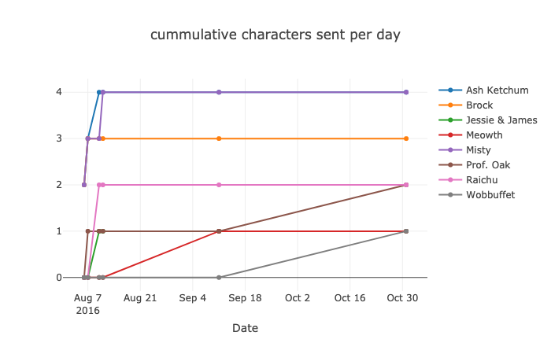

# [whatstk](http://lucasrodes.github.io/whatstk)


[](https://travis-ci.com/lucasrodes/whatstk)
[](https://codecov.io/gh/lucasrodes/whatstk)
[](https://www.python.org/downloads/release/python-3/)
[](docs/index.md)
[](https://github.com/lucasrodes/whatstk/blob/master/LICENSE)


<!-- [](https://pepy.tech/project/whatstk) -->
> [Get the Desktop App](https://lcsrg.me/whatstk-gui)

whatstk is a Python module for WhatsApp chat group analysis and distributed under the GPL-3.0 license. 

:star: Please **star** our project if you found it interesting to **keep us motivated** :smiley:!


## Installation

Tested on Python 3.7

```
pip install whatstk
```

## Getting Started

Make sure to first obtain the chat to be analyzed. Export it as a `txt` file using your phone (more info on this [here](https://lcsrg.me/whatstk-gui/#faqs)).

Check more on how-to use it in the [docs](docs/index.md)

### Obtain a dataframe from your chat log file

Load your chat using the object `WhatsAppChat`. Example below we use chat [example.txt](chats/example.txt)
 
 
```python
from whatstk import WhatsAppChat

filename = 'chats/example.txt'
chat = WhatsAppChat.from_txt(filename)
```

Once you have your `WhatsAppChat` object, you can access the loaded data using the class attribute `df`, i.e. `chat.df`.

```python
chat.df.info()
```
> <details><summary>See results</summary>
> <p>
> 
> ```
> <class 'pandas.core.frame.DataFrame'>
> DatetimeIndex: 18 entries, 2016-08-06 13:23:00 to 2016-10-31 12:23:00
> Data columns (total 2 columns):
>  #   Column    Non-Null Count  Dtype 
> ---  ------    --------------  ----- 
>  0   username  18 non-null     object
>  1   message   18 non-null     object
> dtypes: object(2)
> memory usage: 432.0+ bytes
> ```
</p>
</details>

_Note 1: By default, header auto-detect feature is used. If it does not work, use hformat variable to specify your
header format. In our example, it would be: `hformat = '%d.%m.%y, %H:%M - %name:'`. More on this [here](#whats-the-header)_.

_Note 2: If your chat uses 12h clock, it may not work as expected. If it is your case, please report it in the issues section._


### Plot the cumulative messages sent by day
Once you have your `WhatsAppChat` object, you can easily get the number of interventions per user per, say, `day` using 
the method `interventions()` with `date_mode` argument set to `'day'`. With this, some minor processing, `plotly` and `vis` method from `whatstk.plot` you can get really insightful plots.


```python
from whatstk.analysis import interventions
counts = interventions(chat=chat, date_mode='date', msg_length=False)
counts_cumsum = counts.cumsum()

# Plot result
from plotly.offline import plot
from whatstk.plot import vis
plot(vis(counts_cumsum, 'cumulative number of messages sent per day'))
```



## What's the header?
The chat file syntax can differ between devices, OS and language settings, which makes it hard some times to correctly parse the data and make WhatsTK work correctly.

The header appears for each message sent in the chat. It contains a timestamp and the name of the user that sent the message.

See it for yourself and open the exported chat file. You will find that the messages have a similar format like the one
below:

```
15.04.2016, 15:04 - You created group “Sample Group”
06.08.2016, 13:18 - Messages you send to this group are now secured with end-to-end encryption. Tap for more info.
06.08.2016, 13:23 - Ash Ketchum: Hey guys!
06.08.2016, 13:25 - Brock: Hey Ash, good to have a common group!
06.08.2016, 13:30 - Misty: Hey guys! Long time haven't heard anything from you
06.08.2016, 13:45 - Ash Ketchum: Indeed. I think having a whatsapp group nowadays is a good idea
06.08.2016, 14:30 - Misty: Definetly
06.08.2016, 17:25 - Brock: I totally agree
07.08.2016, 11:45 - Prof. Oak: Kids, shall I design a smart poke-ball?
```

In this example, the header is `day.month.year, hour:minutes - username:` which corresponds to the header format
`%d.%m.%y, %H:%M - %name:`. However, in your case it may be something else. Check table below to see the codes for each
header unit.

<table class="tg" style="display: flex; justify-content: center;">
  <tr>
    <th class="tg-7btt">Date Unit Code</th>
    <th class="tg-7btt">Definition</th>
  </tr>
  <tr>
    <td class="tg-0pky">%y</td>
    <td class="tg-0pky">Year</td>
  </tr>
  <tr>
    <td class="tg-0pky">%m</td>
    <td class="tg-0pky">Month of the year (1-12)</td>
  </tr>
  <tr>
    <td class="tg-0pky">%d</td>
    <td class="tg-0pky">Day of the month (0-31)</td>
  </tr>
  <tr>
    <td class="tg-0pky">%H</td>
    <td class="tg-0pky">Hour 24h-clock (0-23)</td>
  </tr>
  <tr>
    <td class="tg-0pky">%P</td>
    <td class="tg-0pky">Hour 12h-clock (1-12)</td>
  </tr>
  <tr>
    <td class="tg-0pky">%M</td>
    <td class="tg-0pky">Minutes (0-60)</td>
  </tr>
  <tr>
    <td class="tg-0pky">%S</td>
    <td class="tg-0pky">Seconds (0-60)</td>
  </tr>
  <tr>
    <td class="tg-0pky">%name</td>
    <td class="tg-0pky">Name of user</td>
  </tr>
</table>

## Known issues
- 12h clock header format is not supported.

## Contribute

We are very open to have collaborators. You can freely fork and issue a pull request with your updates!
For other issues/bugs/suggestions, please report it as an issue or [text me](mailto:lucasrg@kth.se).

### Pull Requests

Make sure to test your code before issuing a pull request:

```
py.test --cov-report term --cov=whatstk tests/
```

_Note 1: Use `--html=testreport.html --cov-report html` to generate HTML reports._

However, pull requests will trigger the Travis CI pipeline, which will run the tests as well.