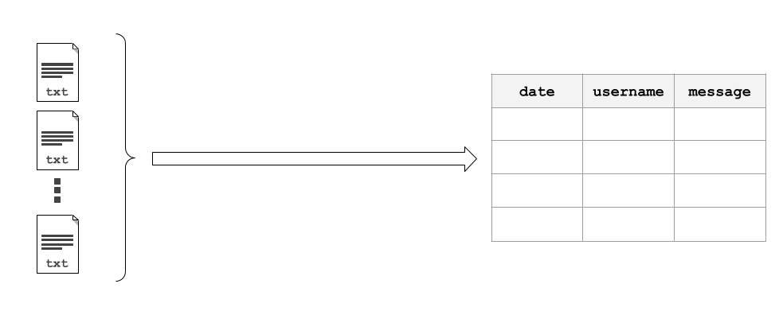

WhatsAppChat
============

Object :class:`WhatsAppChat <whatstk.WhatsAppChat>` works as a bridge between the python code and the whatsapp chat text
file. Easily load a chat from a text file and work with it using all the power of
`pandas <https://pandas.pydata.org/>`_. 

A chat can be loaded from a single source file using :func:`WhatsAppChat.from_source <whatstk.WhatsAppChat.from_source>`

.. image:: ../../_static/images/WhatsAppChat.from_source.png
    :width: 1000
    :alt: Concept diagram of WhatsAppChat.from_source

or multiple source files using :func:`WhatsAppChat.from_sources <whatstk.WhatsAppChat.from_sources>`

    
.. autoclass:: whatstk.WhatsAppChat
    :members:
    :undoc-members:
    :show-inheritance:
    :inherited-members:
